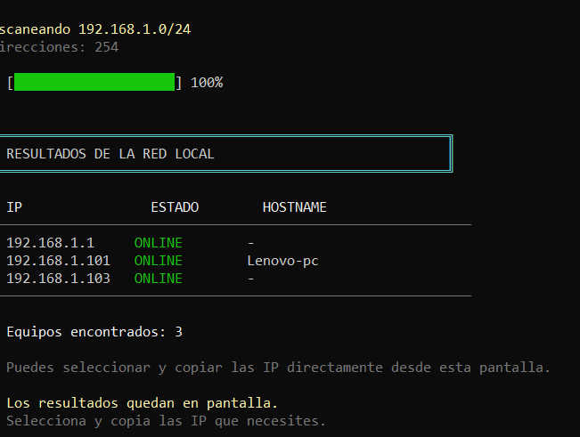
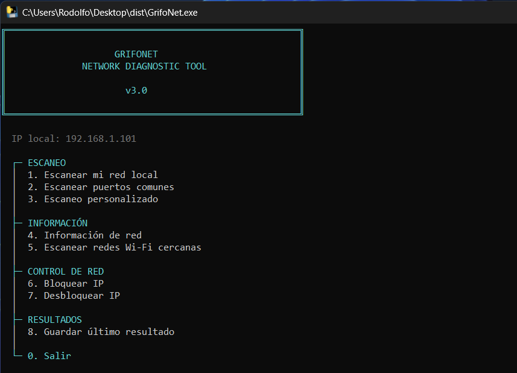

<div align="center">


# 🦅 GrifoNet

### Mini Network Scanner & Network Diagnostic Tool


## 🦅 ¿Qué es GrifoNet?

**GrifoNet** es una herramienta sencilla de diagnóstico y análisis de redes desarrollada en **Python para Windows**.

Está diseñada principalmente para **aprendizaje, pruebas autorizadas y diagnóstico de redes locales**.

La herramienta utiliza funciones integradas de Windows y módulos estándar de Python, por lo que no necesita una gran cantidad de dependencias externas.


---

## 📸 Captura




## ✨ Funciones

### 🌐 Escaneo de red local

Detecta dispositivos que responden dentro de la red local.

Muestra:

* Dirección IP
* Estado
* Nombre del equipo / hostname
* Cantidad de dispositivos encontrados
* Progreso del escaneo

Ejemplo:

```text
IP                ESTADO        HOSTNAME
192.168.1.1       ONLINE        -
192.168.1.101     ONLINE        -
192.168.1.102     ONLINE        Lenovo-PC
192.168.1.103     ONLINE        -
```

---

### 🔌 Escaneo de puertos

Permite comprobar puertos comunes de un equipo específico.

Incluye servicios como:

* FTP
* SSH
* Telnet
* DNS
* HTTP
* HTTPS
* SMB
* RDP
* MySQL
* PostgreSQL
* VNC

También incluye un modo de **escaneo personalizado de puertos**.

---

### 📡 Escaneo de redes Wi-Fi cercanas

Utiliza las herramientas de Windows para mostrar las redes Wi-Fi detectadas por el adaptador.

Puede mostrar:

* SSID
* Señal
* Seguridad
* BSSID

> ⚠️ En algunas versiones de Windows, la consulta de redes Wi-Fi puede requerir que los **servicios de ubicación** estén habilitados.

Si Windows bloquea la consulta, GrifoNet muestra instrucciones para acceder a:

```text
ms-settings:privacy-location
```

Puedes abrirlo con:

```text
WIN + R
```

y pegar:

```text
ms-settings:privacy-location
```

---

### 💻 Información de red

Muestra información básica del equipo y su conexión:

* Nombre del equipo
* Sistema operativo
* Versión de Windows
* Arquitectura
* Adaptador
* Estado de conexión
* SSID
* IP local
* Máscara de subred
* Gateway
* Red detectada
* Cantidad de hosts

---

### 💾 Guardar resultados

Permite guardar los resultados obtenidos durante el diagnóstico para poder consultarlos posteriormente.

---

## 🛠️ Tecnologías utilizadas

| Tecnología           | Uso                                  |
| -------------------- | ------------------------------------ |
| 🐍 Python 3          | Lenguaje principal                   |
| 🪟 Windows           | Plataforma principal                 |
| `socket`             | Comunicación de red                  |
| `ipaddress`          | Manejo de direcciones IP y redes     |
| `subprocess`         | Ejecución de herramientas de Windows |
| `concurrent.futures` | Escaneo concurrente                  |
| `json`               | Almacenamiento de datos              |
| `platform`           | Información del sistema              |
| `re`                 | Procesamiento de texto               |
| `os`                 | Funciones del sistema                |
| `datetime`           | Fecha y hora                         |
| Git                  | Control de versiones                 |
| GitHub               | Alojamiento del proyecto             |

---

## 📋 Requisitos

* Windows 10 o Windows 11
* Python 3.x

La mayoría de las funciones utilizan módulos incluidos con Python.

No es necesario instalar paquetes externos para ejecutar el archivo `.py`.

---

## 🚀 Instalación

Clona el repositorio:

```bash
git clone https://github.com/xyvenqorix/GrifoNet.git
```

Entra en la carpeta:

```bash
cd GrifoNet
```

Ejecuta:

```bash
python grifonet.py
```

---

## 📦 Ejecutar como EXE

Si quieres crear una versión ejecutable para Windows puedes utilizar **PyInstaller**.

Instalación:

```bash
pip install pyinstaller
```

Compilación:

```bash
pyinstaller --onefile --console --name GrifoNet grifonet.py
```

El ejecutable se encontrará en:

```text
dist/GrifoNet.exe
```

---

## 🖥️ Compatibilidad

| Sistema    | Soporte |
| ---------- | :-----: |
| Windows 11 |    ✅    |
| Windows 10 |    ✅    |
| Linux      |    ❌    |
| macOS      |    ❌    |

> GrifoNet está desarrollado específicamente para utilizar comandos y características disponibles en Windows.

---

## 🔐 Uso responsable

GrifoNet fue creado con **fines educativos, de aprendizaje y diagnóstico de redes**.

Utiliza la herramienta únicamente en:

* Tus propios equipos.
* Tu propia red.
* Laboratorios.
* Entornos de pruebas.
* Sistemas para los que tengas autorización.

No utilices GrifoNet para acceder, interferir o realizar pruebas contra sistemas o redes sin autorización.

**El usuario es responsable del uso que haga de la herramienta.**

Consulta `LICENSE.md` para conocer los términos completos de uso.

---

## 🎯 Objetivo del proyecto

El objetivo de GrifoNet es crear una alternativa **simple, ligera y fácil de entender** para aprender conceptos básicos relacionados con:

* Redes TCP/IP
* Direcciones IP
* Hosts
* Puertos
* Servicios de red
* Wi-Fi
* Diagnóstico de conectividad
* Herramientas de Windows
* Automatización con Python

---

## 📁 Estructura

```text
GrifoNet/
│
├── captura/
│   └── captura.png
│
├── grifonet.py
│
├── LICENSE.md
│
└── README.md
```

---

## 📜 Licencia

GrifoNet utiliza una licencia propia de **Uso Responsable y Fines Educativos**.

Consulta:

```text
LICENSE.md
```

para conocer las condiciones completas.

---

## 🦅 GrifoNet

**Simple. Educativo. Responsable.**

Desarrollado por **xyvenqorix** · 2026
